# Real-Time Stock Market Analytics Platform

An end-to-end real-time data engineering project that ingests simulated stock-market events through Apache Kafka, processes them using Spark Structured Streaming, stores curated data in PostgreSQL using a Bronze-Silver-Gold architecture, and exposes analytics through Power BI and Grafana.

The project also includes data-quality validation, rejected-record quarantine, idempotent processing, operational alerts, pipeline auditing, Apache Airflow monitoring, unit tests, and GitHub Actions CI.

---

## Project Objectives

The project demonstrates how to design and build a production-style streaming data platform with:

- Real-time event ingestion
- Distributed stream processing
- Medallion architecture
- Data-quality enforcement
- Idempotent database writes
- Operational monitoring and alerting
- Workflow orchestration
- Business intelligence reporting
- Automated CI validation

---

## Project Screenshots

### Power BI — Market Overview

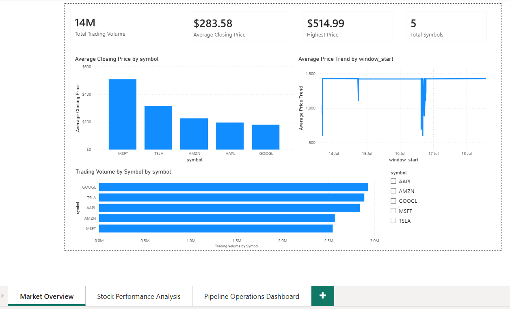

### Power BI — Stock Performance Analysis

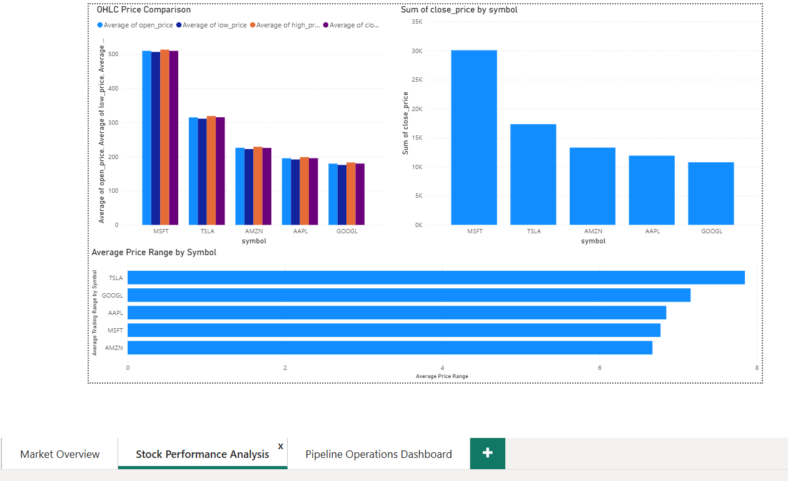

### Power BI — Pipeline Operations

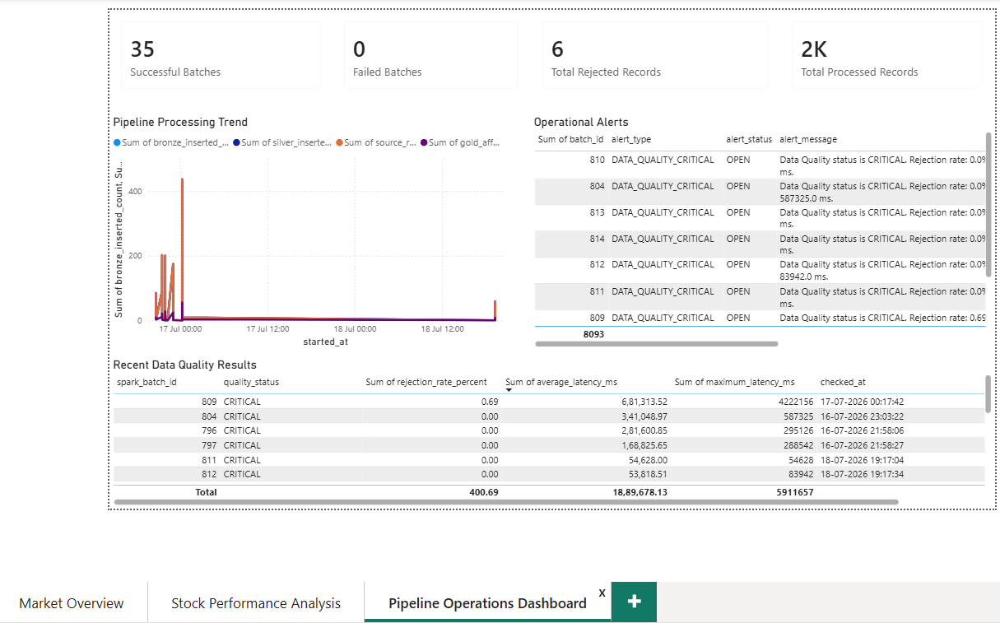

### Grafana — Operational Monitoring

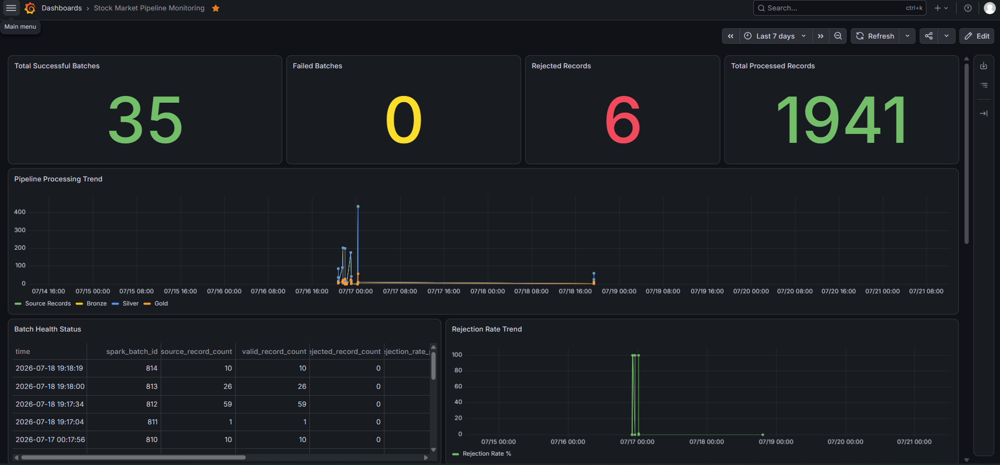

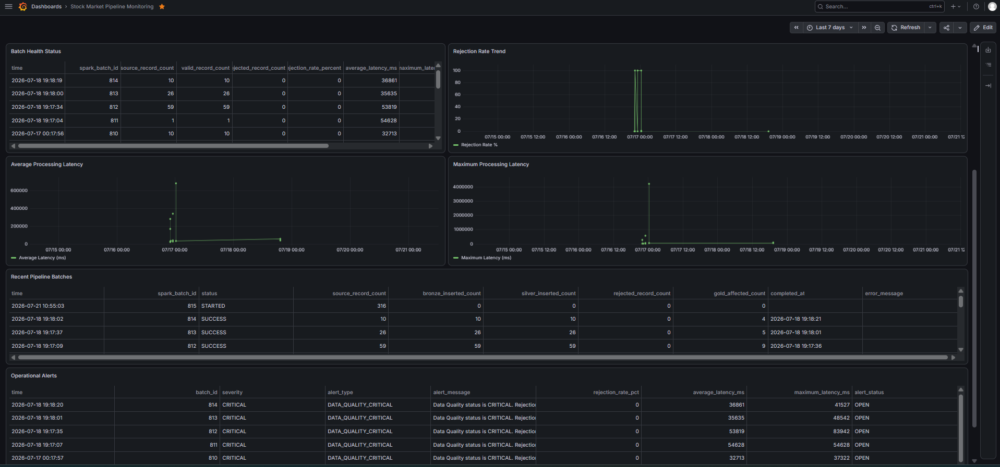

### Airflow — Successful Service Health Check

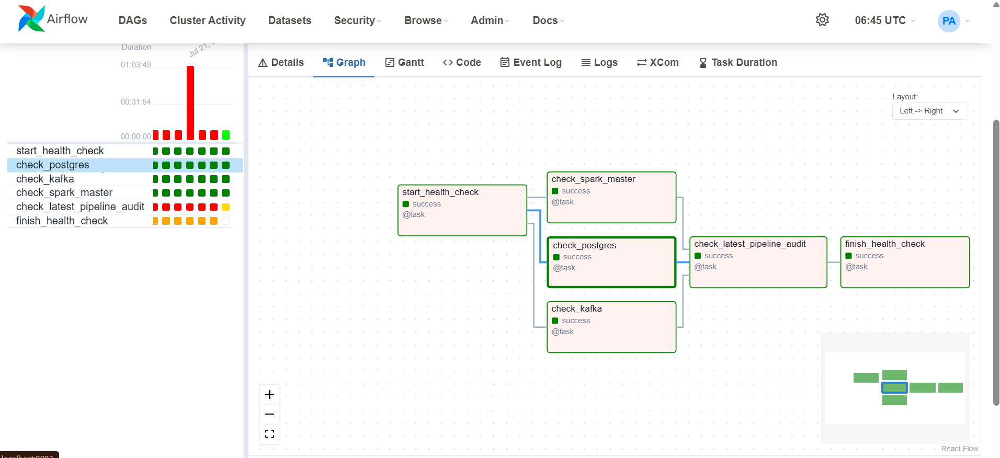

### Airflow — Stale Pipeline Detection

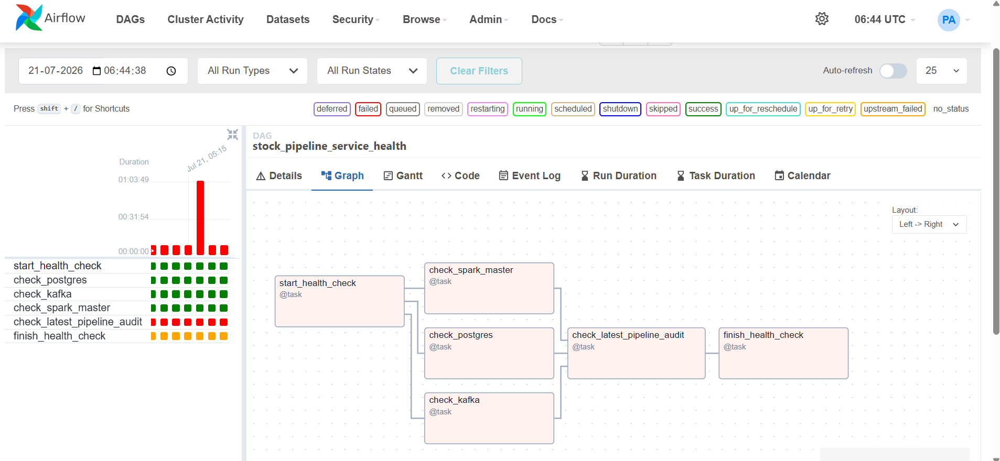

### GitHub Actions — CI Success

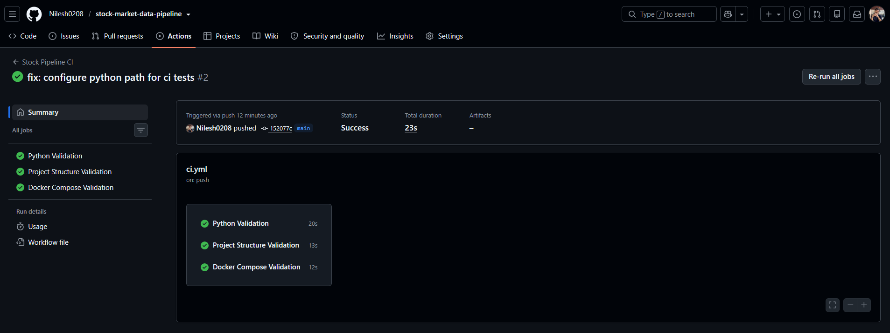

### Kafka Producer

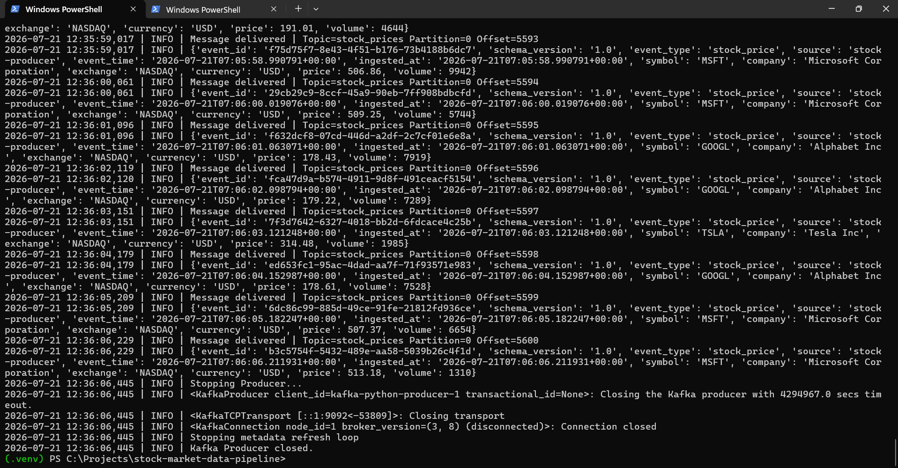

### Spark Structured Streaming

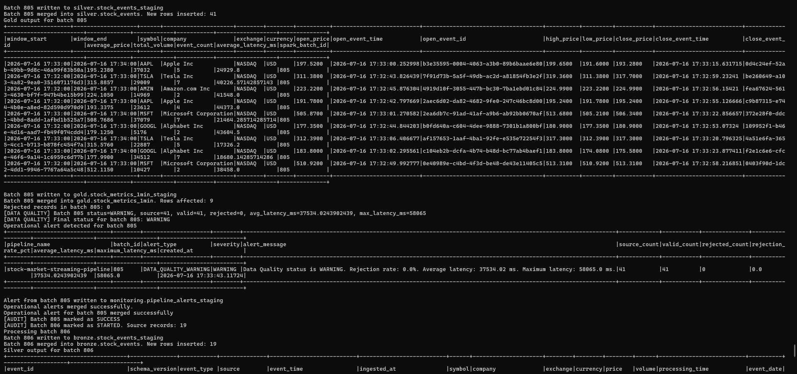

### PostgreSQL — Medallion Schemas

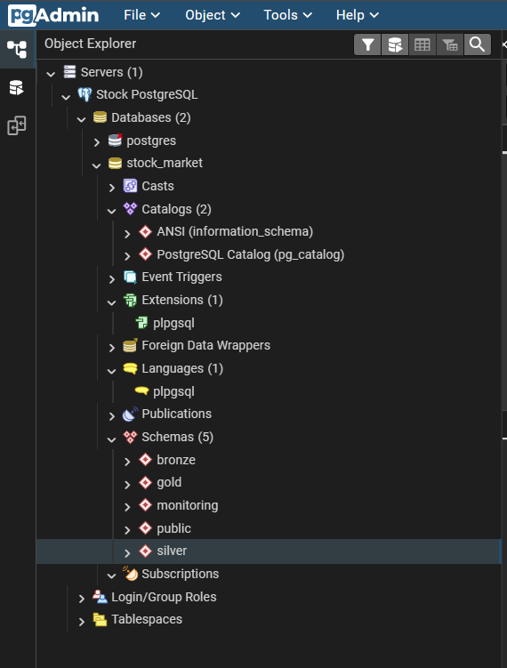

### PostgreSQL — Bronze Data

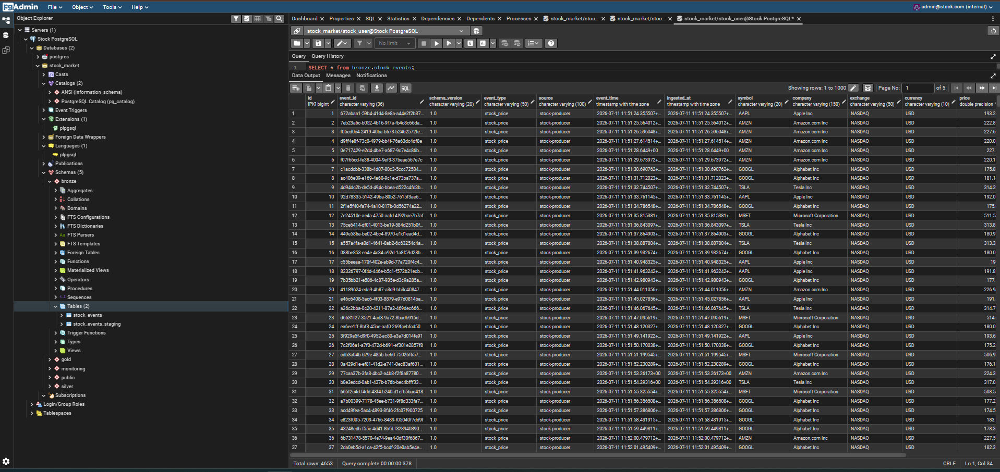

---

## Architecture

```text
Python Stock Producer
        |
        v
Apache Kafka
        |
        v
Spark Structured Streaming
        |
        +------------------------------+
        |                              |
        v                              v
Bronze Layer                    Rejected Records
Raw Event Storage               Data Quarantine
        |
        v
Silver Layer
Cleaned and Validated Events
        |
        v
Gold Layer
One-Minute Stock Metrics
        |
        v
PostgreSQL
        |
        +-------------------+-------------------+
        |                   |                   |
        v                   v                   v
Power BI                Grafana             Airflow
Analytics Dashboard     Monitoring          Health Checks
```

---